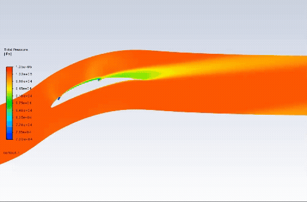
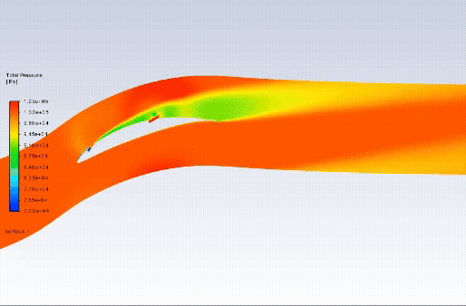
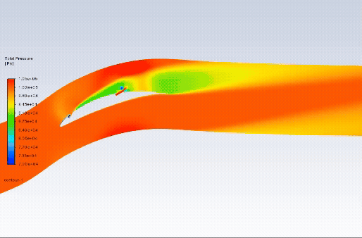

# DA-HA-SAC

### Dual-Actuator History-Augmented Soft Actor–Critic
### for Compressor-Cascade Flow Control

**Closed-loop separation suppression and total-pressure-loss reduction using deep reinforcement learning**

---

## Flow-Control Visualisations

The following animations compare the **DA-HA-SAC-controlled flow** with the corresponding **uncontrolled baseline** over **0–100 control steps**.

<table>
  <tr>
    <td align="center"><strong>Incidence = 8°</strong></td>
    <td align="center"><strong>Incidence = 11°</strong></td>
    <td align="center"><strong>Incidence = 12°</strong></td>
  </tr>
  <tr>
    <td width="33.33%" align="center" valign="top">
      <strong>DA-HA-SAC controlled</strong>  
      
    </td>
    <td width="33.33%" align="center" valign="top">
      <strong>DA-HA-SAC controlled</strong>  
      
    </td>
    <td width="33.33%" align="center" valign="top">
      <strong>DA-HA-SAC controlled</strong>  
      
    </td>
  </tr>
  <tr>
    <td width="33.33%" align="center" valign="top">
      <strong>Uncontrolled baseline</strong>  
      
    </td>
    <td width="33.33%" align="center" valign="top">
      <strong>Uncontrolled baseline</strong>  
      
    </td>
    <td width="33.33%" align="center" valign="top">
      <strong>Uncontrolled baseline</strong>  
      
    </td>
  </tr>
</table>

## Overview

This repository accompanies the manuscript:

> **Dual-Actuator History-Augmented Reinforcement Learning for Separation Suppression and Loss Reduction in a Compressor Cascade**

The study develops a **dual-actuator history-augmented soft actor–critic (DA-HA-SAC)** framework for closed-loop control of suction-surface separation in a two-dimensional NACA 65 compressor cascade.

Two independently controlled actuators are positioned at **15% and 60% chord**. Each actuator can operate in either blowing or suction mode. The controller uses history-stacked pressure measurements, downstream total-pressure-loss information, and previous actuator commands to address partial observability and delayed aerodynamic responses.

A delay-aware, stage-dependent reward function combines:

- reverse-flow suppression;
- total-pressure-loss reduction;
- actuation efficiency;
- actuator-command smoothness.

Parallel CFD environments are used to train a single policy at incidence angles of **8°, 11°, and 12°**.

## Main Findings

The learned policy suppresses suction-surface separation and narrows the downstream high-loss region at all three incidence angles.

- The peak pitchwise total-pressure-loss coefficient is reduced by **more than 30%**.
- The RL policy achieves higher actuation efficiency than mass-flow-matched constant-jet control at all three incidence angles.
- At **11° and 12°**, RL improves both loss reduction and actuation efficiency.
- The learned strategy exhibits a two-stage control mechanism:
  1. incidence-dependent transient restructuring through coordinated suction and blowing;
  2. predominantly blowing-based quasi-steady flow maintenance.

## Citation

Please cite the associated manuscript when using the methods, results, or visualisations provided in this repository.

Citation information will be updated after publication.

## Contact

**Yizhou Luo**  
School of Energy Science and Engineering  
Harbin Institute of Technology  
Email: [luoyizhou@stu.hit.edu.cn](mailto:luoyizhou@stu.hit.edu.cn)
